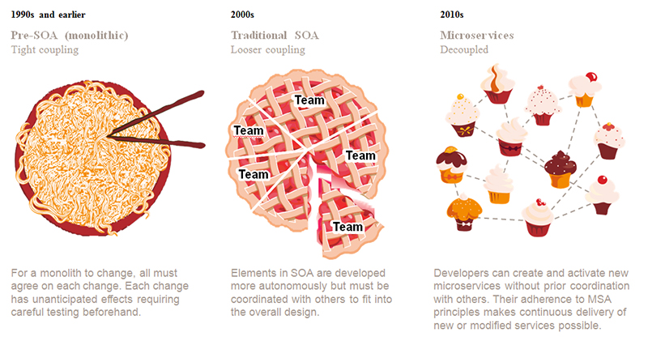
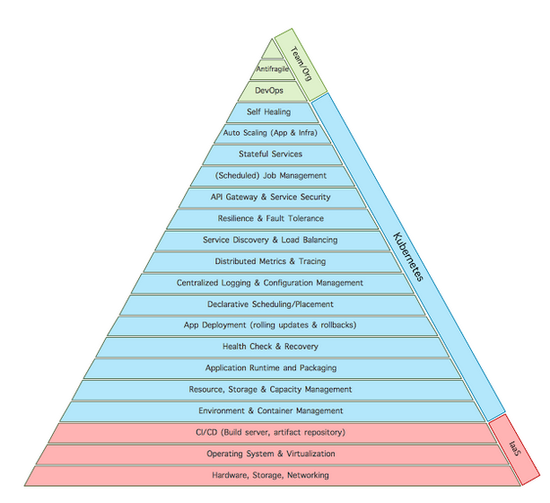
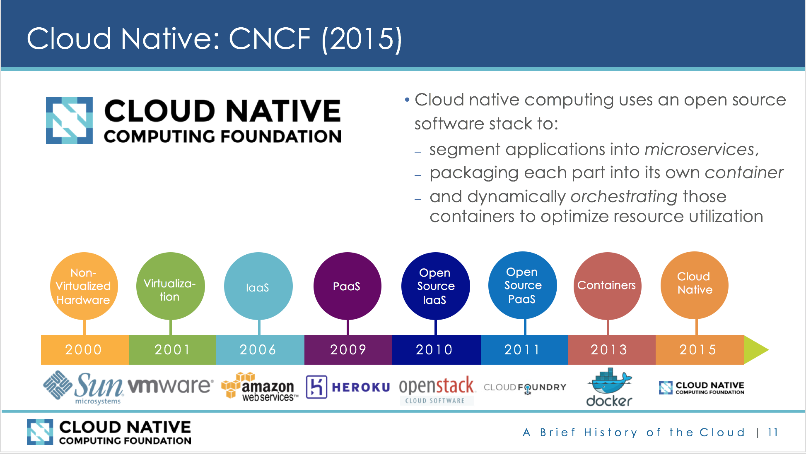
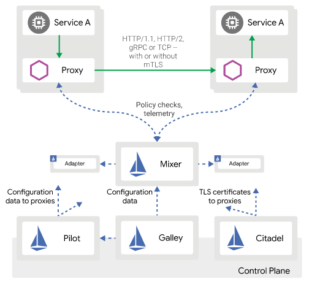

<!-- $theme: default -->
---
<!--marp: true-->
# Istio

Istio lets you connect, secure, control, and observe services

---

How we ended up here ?

---


* http://usblogs.pwc.com/emerging-technology/agile-coding-in-enterprise-it-code-small-and-local/

---

breaking from monolith to distributed lead to:

* http://www.ofbizian.com/2017/02/microservices-hierarchy-of-needs.html
---


* https://www.allthingsdistributed.com/2018/04/changing-calculus-containers-cloud.html

---


---
All that lead to this point of time where we have CNCF



---

Now imagine if we can give each container a **helper** that handles some of the needs above (load balancing, timeouts, traffic encryption, and much more) **without changing** our container code or even knowing what's inside it

that's called side car pattern in distributed systems, and with k8s it became generic enough to implement a framework based on it

---


  
---
[What is istio](https://istio.io/docs/concepts/what-is-istio/)

- data plane: proxies mediate and control all network communication between microservices

- control plane: 
  - manages and configures the proxies to route traffic (pilot & citadel)
  - configures Mixers to enforce policies and collect telemetry
---
## Istio resources intro

### Networking & Traffic management:
  - Destination rules:
    - https://istio.io/docs/reference/config/networking/v1alpha3/destination-rule/
    - define all rules/policies that should be applied to a specific destination:
      - timeouts, retries, connection pooling, circuit breaking
      - security related policies like mutual TLS
    - label-based policies can be specified (subsets)
---
example:
```yaml
apiVersion: networking.istio.io/v1alpha3
kind: DestinationRule
metadata:
  name: bookinfo-ratings
spec:
  host: ratings.prod.svc.cluster.local
  # default load balancing policy
  trafficPolicy:
    loadBalancer:
      simple: LEAST_CONN
  # uses a round robin load balancing policy for all traffic going to a
  # subset named testversion that is composed of endpoints (e.g., pods) with
  # labels (version:v3).
  subsets:
  - name: testversion
    labels:
      version: v3
    trafficPolicy:
      loadBalancer:
        simple: ROUND_ROBIN
```
---    
Virtual service:
  - https://istio.io/docs/reference/config/networking/v1alpha3/virtual-service/
  - manages everything in the context of routing
  - here we can put routing logic and forward traffic to a host while applying DestinationRules related to that route
---
```yaml
apiVersion: networking.istio.io/v1alpha3
kind: VirtualService
metadata:
  name: reviews-route
spec:
  hosts:
  - reviews.prod.svc.cluster.local
  http:
  # conditional route
  - match:
    - uri:
        prefix: "/wpcatalog"
    # or
    - uri:
        prefix: "/consumercatalog"
    rewrite:
      uri: "/newcatalog"
    route:
    - destination:
        host: reviews.prod.svc.cluster.local
        subset: v2
  # default route:
  - route:
    - destination:
        host: reviews.prod.svc.cluster.local
        subset: v1
```
---
the corresponding `DestinationRules`:

```yaml
apiVersion: networking.istio.io/v1alpha3
kind: DestinationRule
metadata:
  name: reviews-destination
spec:
  host: reviews.prod.svc.cluster.local
  subsets:
  - name: v1
    labels:
      version: v1
  - name: v2
    labels:
      version: v2
```
---
Gateway:
  - load balancer / edge of the mesh
  - enable ingress traffic for an application.
  - docs: https://istio.io/docs/reference/config/networking/v1alpha3/gateway/
---

```yaml
apiVersion: networking.istio.io/v1alpha3
kind: Gateway
metadata:
  name: my-gateway
spec:
  selector:
    istio: ingressgateway # use istio default controller
  servers:
  - port:
      number: 80
      name: http
      protocol: HTTP
    hosts:
      - my.host.com
```

---

connect the gateway with a virtual services:

```yaml
apiVersion: networking.istio.io/v1alpha3
kind: VirtualService
metadata:
  name: frontend-service
spec:
  hosts:
  - my.host.com
  gateways:
  - my-gateway
  http:
  - route:
    - destination:
        host: frontend
        port:
          number: 80
```
--- 

ServiceEntry (egress):
  - https://istio.io/docs/reference/config/networking/v1alpha3/service-entry/
  - used to connect to outside services
  - can be wrapped with DestinationRule so other services make use of istio
  in communications with these services (see docs link for example)

---

```yaml
apiVersion: networking.istio.io/v1alpha3
  kind: ServiceEntry
  metadata:
    name: jsontime
  spec:
    hosts:
    - worldclockapi.com
    ports:
    - number: 80
      name: http
      protocol: HTTP
    - number: 443
      name: https
      protocol: HTTPS
```
---
others:
  - EnovyFilter https://istio.io/docs/reference/config/networking/v1alpha3/envoy-filter/
  - Sidecar https://istio.io/docs/reference/config/networking/v1alpha3/sidecar/

---
